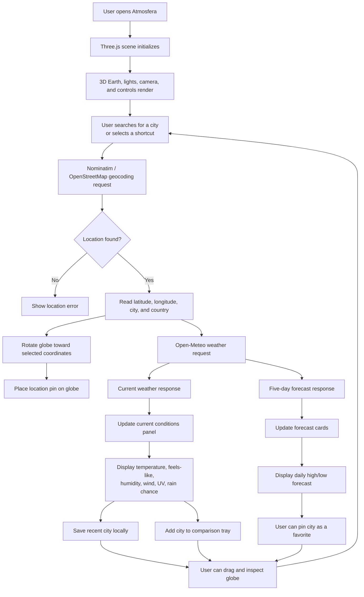

# Atmosfera

Atmosfera is an interactive weather globe built with Three.js, Open-Meteo, and OpenStreetMap geocoding. Search for any city and the 3D Earth rotates to that location while showing live weather conditions and a five-day forecast.

[Live demo](https://chandra23225.github.io/Atmosfera/)

## Highlights

- Interactive 3D Earth with drag-to-rotate controls
- Smooth fly-to animation when a city is searched
- Current weather, feels-like temperature, humidity, wind, UV index, and rain chance
- Five-day forecast with daily high/low temperatures
- Quick city shortcuts, pinned favorites, recent searches, and weather comparison
- Location pin on the globe surface
- No API keys required
- Fully static frontend that can run on GitHub Pages

## Local Experience

- Recent searches and pinned cities are saved in browser `localStorage`.
- Favorite cities appear first in the quick shortcut row.
- The comparison tray keeps the latest searched cities in the current session so temperatures and conditions can be compared quickly.

## Data Sources

- [Open-Meteo](https://open-meteo.com/): weather and forecast data
- [Nominatim / OpenStreetMap](https://nominatim.org/): city geocoding

## Workflow



### Workflow Summary

1. The browser loads the static frontend and initializes the Three.js globe.
2. The user searches for a city or selects a quick shortcut.
3. Nominatim converts the city name into latitude and longitude.
4. The globe rotates to the selected location and places a pin on the surface.
5. Open-Meteo returns current weather and forecast data for that coordinate.
6. The UI updates the current weather panel and five-day forecast cards.
7. The browser saves recent searches and optional pinned favorites locally.
8. The comparison tray keeps the latest searched cities visible for quick side-by-side review.
9. The user can keep interacting with the globe or search for another location.

## Tech Stack

- HTML
- CSS
- JavaScript
- Three.js
- GitHub Pages

## Project Structure

```text
Atmosfera/
|-- index.html
|-- css/
|   `-- style.css
|-- js/
|   `-- app.js
|-- wea/
|   `-- index.html
`-- README.md
```

## Run Locally

Clone the repository:

```bash
git clone https://github.com/chandra23225/Atmosfera.git
cd Atmosfera
```

Serve it with any static file server:

```bash
npx serve .
```

Or use Python:

```bash
python -m http.server 8080
```

Then open:

```text
http://localhost:8080
```

You can also open `index.html` directly, but using a local server is more reliable for browser APIs and external assets.

## Deployment

Atmosfera is a static site and is suitable for:

- GitHub Pages
- Netlify
- Vercel
- Cloudflare Pages

The current live version is hosted on GitHub Pages.

## Notes

Open-Meteo does not require an API key. Nominatim is a public geocoding service, so heavy production usage should follow OpenStreetMap's usage policy or move to a dedicated geocoding provider.

## License

MIT
